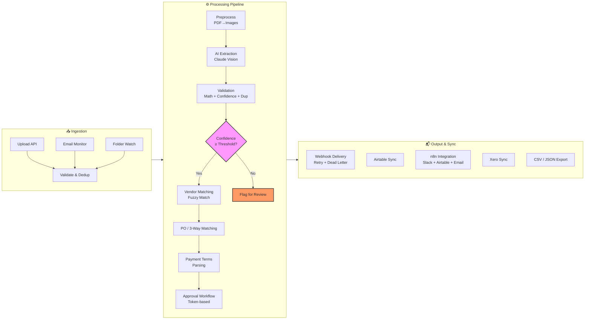

# 📄 Invoice Processing Automation System

[](https://github.com/tairq/Invoice-Automation/actions/workflows/ci.yml)

AI-powered invoice processing that handles **any kind of invoice** automatically — PDFs, scanned images, digital invoices — extracting structured data with Claude AI and processing them through a complete pipeline from ingestion to export.

## 💡 Why this project

Finance teams waste thousands of hours manually keying invoice data into ERP systems, with error rates that compound across AP workflows. This system replaces that with a single upload (or email forward) that goes from raw document to structured, validated, and synced data — ready for payment, audit, or export. Built with async Python and Celery, it scales from a single-tenant deployment to a multi-org service without re-architecture.

## ✨ Features

- **🤖 AI-Powered Extraction** — Uses Claude Vision API to extract invoice data from any layout without training
- **📎 Multi-Format Support** — PDF, JPG, PNG, TIFF, email attachments (.eml)
- **📤 Multiple Ingestion Sources** — Manual upload via API, email monitoring (IMAP), folder watch
- **📊 Structured Data Extraction** — Vendor info, line items, totals, taxes, bank details, and more
- **✅ Smart Validation** — Cross-field math checks, confidence scoring, duplicate detection
- **⚠️ Human Review Queue** — Low-confidence invoices flagged for manual correction
- **📬 Webhook Notifications** — Real-time alerts on processing completion
- **📥 CSV/JSON Export** — Download processed data for accounting integration
- **📊 Airtable Sync** — Push invoice data directly to Airtable tables
- **✅ Approval Workflow** — Token-based email approval with approve/reject links; auto-approve below threshold
- **📋 PO / 3-Way Matching** — Match invoices against purchase orders via PO number or fuzzy vendor name; detect line-item discrepancies
- **🏢 Vendor Master Matching** — Fuzzy-match extracted vendor names against a curated vendor master list with alias support
- **📅 Payment Due Date Tracking** — Parse payment terms (Net 30, 2/10 Net 30, etc.), track due dates, auto-detect overdue invoices, send reminders
- **🐳 Docker Ready** — Full containerized deployment with Docker Compose

## 🏗️ Architecture



## 🚀 Quick Start

### Prerequisites
- Python 3.11+
- Docker & Docker Compose (for containerized setup)
- An Anthropic API key (for AI extraction)

### Local Development

```bash
# Clone and install
cd invoice-processor
pip install -e ".[dev]"

# Copy environment config
cp .env.example .env
# Edit .env — set your ANTHROPIC_API_KEY

# Start dependencies (Postgres + Redis)
docker compose up postgres redis -d

# Run database migrations
alembic upgrade head

# Start the API
uvicorn app.main:app --reload

# In another terminal, start the worker
celery -A app.workers.invoice_worker.celery_app worker --loglevel=info

```

### Docker (Full Stack)

```bash
# Copy and configure
cp .env.example .env
# Edit .env — set your ANTHROPIC_API_KEY

# Start everything
docker compose up -d

# Check health
curl http://localhost:8000/health
```

## 🚢 Deployment (Railway.app)

This project can be deployed on Railway.app with minimal configuration.

### Steps

1. **Push to GitHub** — Ensure your repository is hosted on GitHub
2. **Create a Railway project** — From the Railway dashboard, click "New Project" → "Deploy from GitHub repo"
3. **Select your repo** — Choose `Invoice-Automation` (or your fork)
4. **Set environment variables** — In the Railway dashboard → your project → Variables tab, add:

   | Variable | Value |
   |----------|-------|
   | `DATABASE_URL` | Railway-provided PostgreSQL connection string (Railway auto-provisions this) |
   | `REDIS_URL` | Railway-provided Redis connection string (add Redis plugin first) |
   | `ANTHROPIC_API_KEY` | Your Claude API key |
   | `ADMIN_API_KEY` | A strong random string for API authentication |
   | `SECRET_KEY` | A strong random string |
   | `STORAGE_BACKEND` | `local` (or configure S3) |
   | `N8N_ENABLED` | `false` (set to `true` if using n8n) |

5. **Add plugins** — From Railway dashboard:
   - Add **PostgreSQL** plugin (version 15+)
   - Add **Redis** plugin (version 7+)

6. **Configure start commands** — Railway uses the `Dockerfile` and `docker-compose.yml` in your repo. If using Docker Compose, set the deploy mode to "Docker Compose" in Railway settings. Railway will automatically:
   - Build the Docker image from your Dockerfile
   - Run database migrations (`alembic upgrade head` runs on startup)
   - Start the API server and Celery worker containers

7. **Deploy** — Railway auto-deploys when you push to your default branch

### Health Check

Once deployed, verify the service:

```bash
curl https://your-app-name.railway.app/health
```

## 📚 API Reference

| Method | Endpoint | Description |
|--------|----------|-------------|
| `POST` | `/api/v1/invoices/upload` | Upload a single invoice |
| `POST` | `/api/v1/invoices/upload/batch` | Upload multiple invoices |
| `GET` | `/api/v1/invoices` | List invoices (filter, sort, paginate) |
| `GET` | `/api/v1/invoices/{id}` | Get invoice detail + extracted data |
| `PATCH` | `/api/v1/invoices/{id}/review` | Human review — correct fields |
| `POST` | `/api/v1/invoices/{id}/reprocess` | Re-run extraction |
| `DELETE` | `/api/v1/invoices/{id}` | Delete invoice |
| `GET` | `/api/v1/invoices/stats` | Dashboard statistics + spend analytics |
| `GET` | `/api/v1/invoices/{id}/log` | Processing audit log |
| `GET` | `/api/v1/approvals/{token}/approve` | Approve invoice via token (no auth) |
| `GET` | `/api/v1/approvals/{token}/reject` | Reject invoice via token (no auth) |
| `POST` | `/api/v1/purchase-orders` | Create purchase order |
| `GET` | `/api/v1/purchase-orders` | List purchase orders |
| `GET` | `/api/v1/purchase-orders/{id}` | Get purchase order |
| `POST` | `/api/v1/vendors` | Create vendor master record |
| `GET` | `/api/v1/vendors` | List vendors |
| `GET` | `/api/v1/vendors/{id}` | Get vendor |
| `PATCH` | `/api/v1/vendors/{id}` | Update vendor |
| `GET` | `/api/v1/exports/csv` | Export invoices as CSV |
| `GET` | `/api/v1/exports/json` | Export invoices as JSON |
| `GET` | `/api/v1/settings/webhook/deliveries` | Webhook delivery history |
| `POST` | `/api/v1/n8n/trigger` | Trigger n8n workflow (optional) |
| `GET` | `/health` | Health check |

## 📊 Airtable Sync

Processed invoice data is automatically pushed to Airtable tables right after extraction. This replaces the traditional dashboard with a live, shareable view of your data.

### Tables

| Table | Description |
|-------|-------------|
| **Invoices** | One record per invoice — vendor, customer, totals, status |
| **Line Items** | Individual line items linked by Invoice ID |

### Setup

1. Create an Airtable base with **Invoices** and **Line Items** tables
2. Add the corresponding fields (the service auto-maps all extraction fields)
3. Configure in `.env`:

```env
AIRTABLE_API_KEY=pat-your-api-key
AIRTABLE_BASE_ID=appYourBaseId
AIRTABLE_SYNC_ENABLED=true
```

## 🎯 n8n Integration

The system can automatically trigger an n8n workflow at the end of every successful invoice pipeline. This enables no-code automation for downstream processes like Slack notifications, Airtable updates, and confirmation emails.

### Flow

```
Invoice processed → Webhook → n8n receives payload → Routes to:
  ├── Slack (team notification)
  ├── Airtable (upsert invoice record)
  └── Email (send confirmation to vendor)
```

### Setup

1. Deploy n8n (self-host or n8n.cloud)
2. Import [`docs/n8n-starter-workflow.json`](docs/n8n-starter-workflow.json) into n8n
3. Configure in `.env`:

```env
N8N_WEBHOOK_URL=https://your-n8n-instance.example.com/webhook/invoice-processed
N8N_ENABLED=true
```

The starter workflow includes:

| Node | Purpose |
|------|---------|
| **Webhook Trigger** | Receives the invoice payload from this system |
| **Send Slack Message** | Posts invoice details (vendor, amount, status) to a channel |
| **Update Airtable** | Upserts the invoice record into Airtable |

You can extend the workflow by adding nodes for email (SMTP), Google Sheets, accounting APIs, or any of n8n's 400+ integrations.

### API Endpoint

You can also trigger the n8n workflow externally:

```bash
curl -X POST http://localhost:8000/api/v1/n8n/trigger \
  -H "X-API-Key: your-api-key" \
  -H "Content-Type: application/json" \
  -d '{"id": "abc-123", "vendor_name": "Acme Corp", ...}'
```

## 🔧 Configuration

Key environment variables (see `.env.example`):

| Variable | Description | Default |
|----------|-------------|---------|
| `DATABASE_URL` | PostgreSQL connection string | `postgresql+asyncpg://...` |
| `REDIS_URL` | Redis connection string | `redis://localhost:6379/0` |
| `ANTHROPIC_API_KEY` | Claude API key | — |
| `ANTHROPIC_MODEL` | Claude model | `claude-sonnet-5-20250601` |
| `CONFIDENCE_THRESHOLD` | Auto-pass threshold | `0.85` |
| `STORAGE_BACKEND` | `local` or `s3` | `local` |
| `EMAIL_HOST` | IMAP server for email monitoring | — |
| `APPROVAL_THRESHOLD` | Min total to require approval (0 = all) | `0` |
| `APPROVAL_BASE_URL` | Base URL for approval links in emails | `http://localhost:8000` |
| `APPROVAL_FROM_EMAIL` | Sender address for approval emails | `noreply@invoiceprocessor.com` |
| `SMTP_HOST` | SMTP server for sending emails | — |
| `SMTP_PORT` | SMTP server port | `587` |
| `SMTP_TLS` | Enable TLS for SMTP | `true` |
| `PAYMENT_REMINDER_EMAIL` | Recipient for payment reminders | `accounts@example.com` |
| `ADMIN_EMAIL` | Recipient for webhook dead-letter alerts | `admin@example.com` |
| `N8N_WEBHOOK_URL` | n8n webhook URL for workflow trigger | — |
| `N8N_ENABLED` | Enable automatic n8n trigger after pipeline | `false` |

## 🧪 Testing

```bash
# Run all tests
pytest

# With coverage
pytest --cov=app --cov-report=term

# Run specific test file
pytest tests/test_api.py -v
```

## 📁 Project Structure

```
invoice-processor/
├── app/
│   ├── main.py                 # FastAPI app entry point
│   ├── config.py               # Settings (pydantic-settings)
│   ├── database.py             # SQLAlchemy engine & session
│   ├── models/                 # Database models (SQLAlchemy)
│   │   ├── invoice.py          # Central invoice entity (approval, PO, vendor, payment)
│   │   ├── extracted_data.py   # Structured extraction output
│   │   ├── line_item.py        # Invoice line items
│   │   ├── extraction_confidence.py
│   │   ├── organization.py     # Multi-tenant support
│   │   ├── processing_log.py   # Audit trail
│   │   ├── approval_token.py   # Token-based approval workflow
│   │   ├── purchase_order.py   # Purchase order master
│   │   ├── po_match.py         # PO match results + discrepancies
│   │   └── vendor.py           # Vendor master list
│   ├── schemas/                # Pydantic request/response schemas
│   ├── routers/                # API route handlers
│   │   ├── invoices.py         # CRUD + upload + review endpoints
│   │   ├── exports.py          # CSV/JSON export
│   │   └── webhooks.py         # Webhook configuration
│   │   └── approvals.py        # Approval, PO, and vendor endpoints
│   ├── services/               # Business logic
│   │   ├── ingestion.py        # File validation, storage, dedup
│   │   ├── preprocessor.py     # PDF→images, OCR fallback
│   │   ├── extractor.py        # AI-powered extraction
│   │   ├── validator.py        # Cross-field validation
│   │   ├── exporter.py         # CSV/JSON generation
│   │   ├── email_monitor.py    # IMAP inbox watching
│   │   ├── approval.py         # Token generation, approval emails, redemption
│   │   ├── po_matching.py      # PO matching + line item comparison
│   │   ├── vendor_matching.py  # Fuzzy vendor name matching
│   │   └── payment_terms.py    # Payment terms parsing (regex + LLM)
│   ├── core/                   # Core utilities
│   │   ├── storage.py          # Local/S3 file storage
│   │   ├── ocr.py              # Tesseract OCR wrapper
│   │   └── llm_client.py       # Claude API client
│   ├── workers/
│   │   └── invoice_worker.py   # Celery async pipeline
│   └── migrations/             # Alembic database migrations
├── tests/                      # Pytest test suite
├── docker-compose.yml          # Full stack orchestration
├── Dockerfile                  # Container build
└── pyproject.toml              # Project config & dependencies
```

## 🔄 Processing Pipeline

1. **Ingestion** — File validated, deduplicated, stored, and queued
2. **Preprocessing** — Converted to images (PDF→PNG, etc.)
3. **AI Extraction** — Claude Vision analyzes and extracts all fields
4. **Validation** — Math cross-checks, confidence scoring, duplicate detection
5. **Storage** — Results saved to PostgreSQL database
6. **Vendor Matching** — Fuzzy-match extracted vendor against master list (rapidfuzz, ≥80%)
7. **PO / 3-Way Matching** — Match invoice against purchase orders; flag line-item discrepancies
8. **Payment Terms Parsing** — Parse "Net 30", "2/10 Net 30", etc.; set due date
9. **Approval Workflow** — Generate approval token, send email with approve/reject links (if above threshold or all invoices require approval)
10. **Webhook Delivery** — Fire webhook notification via Celery task with retry (5 attempts, exponential backoff, dead-letter on failure)
11. **Airtable Sync** — Push data to Airtable tables
12. **n8n Integration** — Trigger n8n workflow (Slack + Airtable + email) if enabled
13. **Xero Sync** — Push to Xero for accounting integration (fully processed invoices only)
14. **Review** (if needed) — Low-confidence or discrepancy-flagged invoices queued for manual correction

## 🛣️ Roadmap

- [x] Core extraction pipeline (upload → AI → validation → storage)
- [x] Multi-format support (PDF, images, TIFF)
- [x] REST API with full CRUD
- [x] Async processing with Celery
- [x] Airtable sync (replaces Streamlit dashboard)
- [x] Email monitoring (IMAP)
- [x] CSV/JSON export
- [x] Docker deployment
- [x] Authentication & API keys
- [x] Approval workflow (token-based email approval)
- [x] PO / 3-way matching (with discrepancy detection)
- [x] Vendor master matching (fuzzy name matching)
- [x] Payment due date tracking (terms parsing, overdue detection, reminders)
- [x] Accounting software integration (Xero)
- [x] S3 storage backend
- [x] CI/CD pipeline (GitHub Actions — lint, test, docker-build)
- [x] Webhook reliability (Celery retry with dead-letter + admin alert)
- [x] n8n integration (Slack + Airtable + email workflow)
- [x] Spend analytics dashboard (monthly trends, top vendors, currencies)
- [ ] Multi-language invoice support
- [ ] Batch processing optimizations
- [ ] Performance benchmark suite

## 📄 License

MIT
